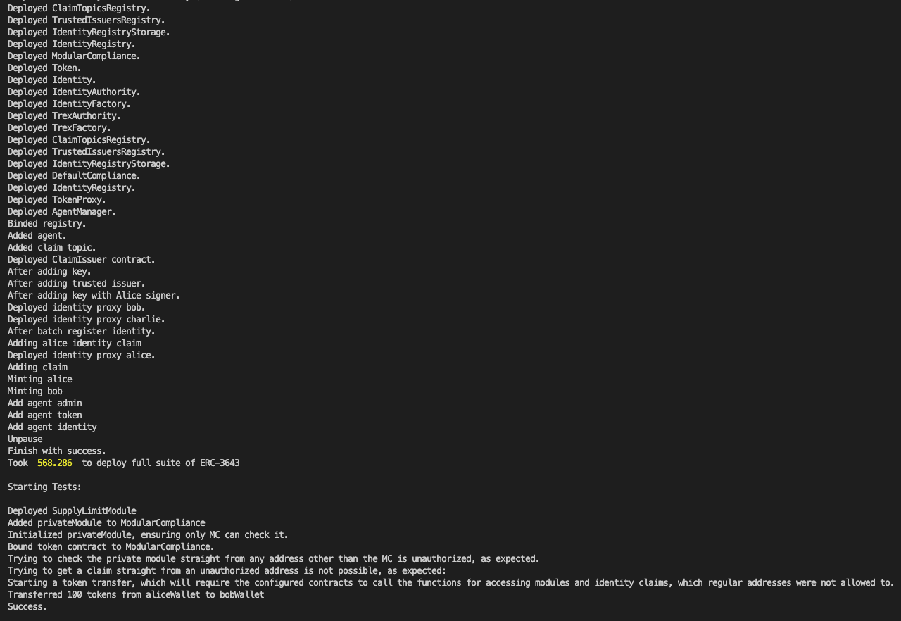

# Hardhat with Silent Data Rollup Provider

## Introduction

This module leverages hardhat to perform a deployment of the ERC-3643 contract suite on a SilentData Rollup environment.There is a script in **hardhat/hardhat-sdr-usage/scripts/deploy.js** that performs the contract deployments and then does some interactions showing the privacy benefits of running the protocol on SDR, which are detailed up next

## Privacy benefits

By running smart contracts on SilentData Rollup we can ensure that the private variables of smart contracts are unreachable by anyone, unlike regular evm chains, where it is possible to fetch the contract data and decode private memory storage locations.

There are two main benefits that could be applied to the ERC-3643 protocol regarding this extra privacy:

1. Ensuring ONCHAINIDS' certificates are only readable by authorized entities;
2. Keeping the data from variables involved in Module Compliance checks, only accessable by the Contracts that need to validate them.

To exemplify these behaviours, we made some changes on the **hardhat/ERC-3643/contracts/compliance/modular/modules/SupplyLimitModule.sol** and **hardhat/solidity/contracts/Identity.sol** contracts, making their private data needed for the protocol validations, inaccessible by unauthorized addresses.

## Execution

To properly setup the environment and run the script that deploys the contracts and performs the interactions, execute the following script with your personal SilentData Rollup token passed as argument:

```bash
cd hardhat
./deploy_trex.sh <SILENT_DATA_ROLLUP_TOKEN>
```

After running, you'll be able to see the contracts deployed and the following interactions leading to a ERC-3643 token transfer:

1. Adding the newly modified private module to the token compliance contract.
2. Checking that an address other than the MC contract, can't check the module's private data
3. Trying to get a claim from the modified Identity contract, with an unauthorized address is rejected.
4. Performing a token transfer is successful, which requires the MC contract to get the private module and the IdentityRegistry to get the Identity claim. Both actions that were negated to unauthorized addresses.

Here is a screenshot of the expected output: flow:


